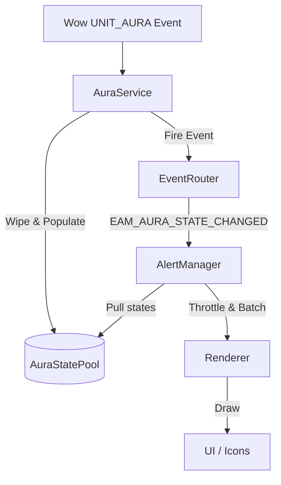

<!-- EAM_DOCUMENTATION_SOURCE: zh-TW -->
# 12.1.0 Aura重構：AuraService解耦合、AuraStatePool設計與雙軌渲染藍圖

本檔案定義了 EventAlertMod (EAM) 進入 12.1.0 世代的核心重構規劃，旨在徹底解耦資料來源與 UI 渲染、減輕 Lua VM 戰鬥記憶體疼痛 (GC Churn)，並完整正式服 12.x C++ Native Duration Binding 通道。

## 一、架構演進：從 Push 連線到 Event-Driven Pull

### 1.目前狀況痛點
在 12.0.7 中，`AuraService.lua` 直接呼叫了 `UI/Renderer.lua` 的 `Renderer.render` 和 `Renderer.requestLayout`。這導致了以下弊端：
* **高耦合性**：`AuraService` 必須知道 `Renderer` 的接口，這使得無法在無 UI 的環境下對資料庫與事件車輛層進行獨立的單元測試（測試單元）。
* **Layout Churn（排版迭代）**：在 `UNIT_AURA` 增量更新中，多個光環同時變更會觸發多次 `render`，導致渲染器重複計算 UI 座標（Layout），浪費 CPU 時間。

### 2.解耦目標
引入**AlertManager**（控制器層）作為加入。
* `AuraService`：純資料服務，只監聽並承載 `UNIT_AURA` 事件，將光環的實體事實寫入 `AuraStatePool`。資料變更後，僅向 `EventRouter` 主動 `EAM_AURA_STATE_CHANGED` 事件。
* `AlertManager`：此監聽事件，使用者負責設定（警報清單、啟用標記）做過濾與渲染決策，並以節流（Throttle）或批次（Batch）的方式請求`Renderer`更新。
* `Renderer` : 純視圖渲染層，只接收包裝好的渲染狀態，透過 IconPool 刷寫到畫面上。

---

## 二、 AuraStatePool：低GC儲存池設計

為消除戰鬥熱路徑中分配與恢復Lua表的GC壓力和卡頓，12.1.0將推廣母公司的**AuraStatePool**。

### 1.結構設計
* 使用 `table.create(preallocatedSize, 0)` 預先指派指定連線空間的大小，主要指派給 `player` 和 `target` 的活動狀態。
* **恢復佇列(恢復佇列)**：
* 當光環消失時，狀態表不會被 `nil` 掉，而是呼叫 `resetState()` 抹除其動態內容，並放入 `AuraStatePool.recycleBin` 中。
    * 新光環觸發時，優先從 `recycleBin` 中 `acquire` 舊表復用，只有在 Pool 乾涸時才建立新物件。

### 2.核心程式碼設計
```lua
local AuraStatePool = {
    active = {},
    recycleBin = {},
    binSize = 0,
}

function AuraStatePool.initialize()
    -- 預先建立 80 個 AuraState 對象備用
    for i = 1, 80 do
        local state = table.create(0, 16)
        state.timer = table.create(0, 4)
        state.source = table.create(0, 3)
        state.boundaryWarnings = table.create(0, 4)
        
        AuraStatePool.recycleBin[i] = state
    end
    AuraStatePool.binSize = 80
end

function AuraStatePool.acquire()
    if AuraStatePool.binSize > 0 then
        local state = AuraStatePool.recycleBin[AuraStatePool.binSize]
        AuraStatePool.recycleBin[AuraStatePool.binSize] = nil
        AuraStatePool.binSize = AuraStatePool.binSize - 1
        return state
    else
        -- 溢出時才分配新對象
        local state = table.create(0, 16)
        state.timer = table.create(0, 4)
        state.source = table.create(0, 3)
        state.boundaryWarnings = table.create(0, 4)
        return state
    end
end

function AuraStatePool.release(state)
    -- 清洗狀態，防止殘留資料污染
    state.id = nil
    state.spellID = nil
    state.name = nil
    state.icon = nil
    state.stacks = nil
    state.active = false
    state.shown = false
    wipe(state.timer)
    wipe(state.source)
    wipe(state.boundaryWarnings)
    
    AuraStatePool.binSize = AuraStatePool.binSize + 1
    AuraStatePool.recycleBin[AuraStatePool.binSize] = state
end
```
### 3.秘密價值指數安全防禦
在戰鬥中，如果未用驗證的Key對自訂表進行索引，一旦該Key為秘密值，Lua就會發生致命的崩潰。
* **規則**：在將 `spellID`、`auraInstanceID` 等欄位寫入任何雜補索引（如 `cache.byInstance[id]` 或 `alertIndex[spellID]`）之前，必須先以 `issecretvalue 進行防禦。
* **降級**：若Key為Secret，此光環直接寫入固定的`EAM.Constants.FALLBACK_SECRET_KEY`，不進行動態雜湊映射。

---

## 三、雙軌渲染：C++ Native Binding 與 Lua OnUpdate 降級通道通道

為了最大化發揮 WoW 12.x 的引擎完成，渲染器將採用**雙軌化時間顯示渲染托盤**。

### 1. 軌道A：原生持續時間綁定（首選，0-Lua-CPU）
* **原理**：
    `C_UnitAuras.GetAuraDuration(unit, auraInstanceID)` 取得底層的 `DurationObject`。
* **執行步驟**：
    1.渲染器取得`timer.durationObject`。
    2.呼叫`C_DurationUtil.CreateDurationTextBinding(durationObject,圖示.timerText)`。
    3.呼叫`icon.cooldown:SetCooldownFromDurationObject(durationObject)`。
* **優勢**：
    圖示上的秒數倒數與轉圈渲染完全由遊戲客戶端 C++ 高階的計時器驅動，**完全不需要註冊 Lua OnUpdate 腳本**，達成 0 頭顱與 0 記憶體。

### 2.軌道B：Lua OnUpdate Central Scheduler (降級通道)
* **原理**：
當`DurationObject`不可用時（例如非戰鬥技能冷卻、手動設定的地面效果時間、或PTR API降級時），返回傳統的Lua倒數。
* **執行步驟**：
    1. 取消 `icon.timerText` 的臨時綁定。
    2. 提示圖示註冊到 `EAM.Core.Scheduler` 集中式排程器。
    3.調度器使用單一的`OnUpdate`以0.1秒的間隔（節流）計算`timeLeft`，並更新文字。
* **安全防禦**：
在 Scheduler 內更新文字前，必須先使用 `issecretvalue(timeLeft)` 保證數字可安全存取的時間，否則將文字顯示為 `"unknown"`，徹底杜絕 Indexing/Arithmetic with Secret 報錯。

---

##四、12.1.0模組化目錄結構預期

12.1.0的重構將進一步優化模組結構，如下所示：
```text
EventAlertMod/
├── Core/
│   ├── EventRouter.lua      (單一事件分派器)
│   └── Scheduler.lua        (集中式 OnUpdate 排程器，驅動 Track B)
├── Services/
│   ├── AuraService.lua      (純數據服務，操作 AuraStatePool)
│   └── CooldownService.lua  (純數據服務)
├── Managers/
│   └── AlertManager.lua     (新增：決策與邏輯過濾層，解耦 UI 與 Service)
├── UI/
│   ├── Renderer.lua         (純渲染層，支持 C++ Native Binding 雙軌渲染)
│   ├── IconPool.lua         (Icon 緩衝物件池)
│   └── Options.lua          (設定面板，防戰鬥 Taint)
└── Locale/
    └── Common.lua           (語系註冊入口，無熱路徑消耗)
```
