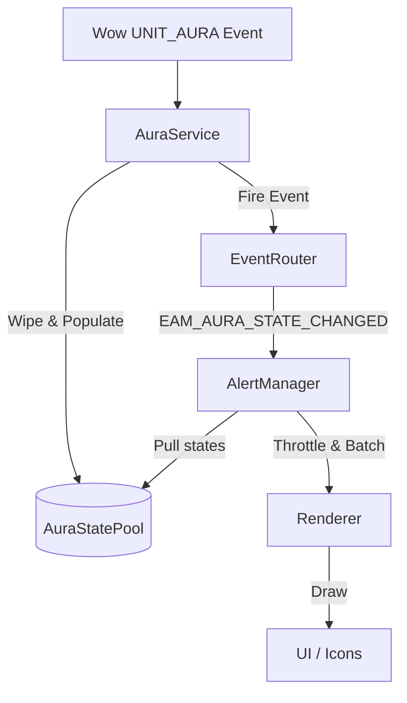

# 12.1.0 Aura 重構：AuraService 解耦、AuraStatePool 設計與雙軌渲染藍圖

本文件定義了 EventAlertMod (EAM) 進入 12.1.0 世代的核心重構規劃，旨在徹底解耦數據源與 UI 渲染、降低 Lua VM 戰鬥記憶體抖動 (GC Churn)，並完整適配 Retail 12.x C++ Native Duration Binding 通道。

## 一、 架構演進：從 Push 耦合走向 Event-Driven Pull

### 1. 現狀痛點
在 12.0.7 中，`AuraService.lua` 直接調用了 `UI/Renderer.lua` 的 `Renderer.render` 與 `Renderer.requestLayout`。這導致了以下弊端：
*   **高耦合性**：`AuraService` 必須知道 `Renderer` 的接口，這使得無法在無 UI 的環境下對數據庫與事件適配層進行獨立的單元測試 (Unit Test)。
*   **Layout Churn (排版抖動)**：在 `UNIT_AURA` 增量更新中，多個光環同時變更會觸發多次 `render`，導致 Renderer 重複計算 UI 坐標 (Layout)，浪費 CPU 時間。

### 2. 解耦目標
引進 **AlertManager**（控制器層）作為中介。
*   `AuraService`：純數據服務，只負責監聽並適配 `UNIT_AURA` 事件，將光環的物理 facts 寫入 `AuraStatePool`。數據變更後，僅向 `EventRouter` 拋出 `EAM_AURA_STATE_CHANGED` 事件。
*   `AlertManager`：監聽此事件，負責依據用戶設定 (alerts 列表、enabled 標記) 做過濾與渲染決策，並以節流 (Throttle) 或批次 (Batch) 的方式請求 `Renderer` 更新。
*   `Renderer` : 純渲染視圖層，只接收包裝好的 Render States，透過 IconPool 刷寫到畫面上。



---

## 二、 AuraStatePool：低 GC 快取池設計

為消滅戰鬥熱路徑中反覆分配與回收 Lua Table 造成的 GC 壓力和卡頓，12.1.0 將引進專有的 **AuraStatePool**。

### 1. 結構設計
*   使用 `table.create(preallocatedSize, 0)` 預先分配指定大小的陣列空間，主要分配給 `player` 與 `target` 的 active states。
*   **Recycle Queue (回收佇列)**：
    *   光環消失時，狀態 Table 不會被 `nil` 掉，而是調用 `resetState()` 抹除其動態內容，並放入 `AuraStatePool.recycleBin` 中。
    *   新光環被觸發時，優先從 `recycleBin` 中 `acquire` 舊 Table 複用，唯有在 Pool 乾涸時才創建新對象。

### 2. 核心代碼設計
```lua
local AuraStatePool = {
    active = {},
    recycleBin = {},
    binSize = 0,
}

function AuraStatePool.initialize()
    -- 預先建立 80 個 AuraState 對象備用
    for i = 1, 80 do
        local state = table.create(0, 16)
        state.timer = table.create(0, 4)
        state.source = table.create(0, 3)
        state.boundaryWarnings = table.create(0, 4)
        
        AuraStatePool.recycleBin[i] = state
    end
    AuraStatePool.binSize = 80
end

function AuraStatePool.acquire()
    if AuraStatePool.binSize > 0 then
        local state = AuraStatePool.recycleBin[AuraStatePool.binSize]
        AuraStatePool.recycleBin[AuraStatePool.binSize] = nil
        AuraStatePool.binSize = AuraStatePool.binSize - 1
        return state
    else
        -- 溢出時才分配新對象
        local state = table.create(0, 16)
        state.timer = table.create(0, 4)
        state.source = table.create(0, 3)
        state.boundaryWarnings = table.create(0, 4)
        return state
    end
end

function AuraStatePool.release(state)
    -- 清洗狀態，防止殘留資料污染
    state.id = nil
    state.spellID = nil
    state.name = nil
    state.icon = nil
    state.stacks = nil
    state.active = false
    state.shown = false
    wipe(state.timer)
    wipe(state.source)
    wipe(state.boundaryWarnings)
    
    AuraStatePool.binSize = AuraStatePool.binSize + 1
    AuraStatePool.recycleBin[AuraStatePool.binSize] = state
end
```

### 3. Secret Value 索引安全防禦
在戰鬥中，如果用未經驗證的 Key 對 custom table 進行 index，一旦該 Key 是秘密值，Lua 將會發生致命崩潰。
*   **規則**：在將 `spellID`、`auraInstanceID` 等欄位寫入任何 hash 索引（例如 `cache.byInstance[id]` 或 `alertIndex[spellID]`）前，必須先以 `issecretvalue(id)` 進行防禦。
*   **降級**：若 Key 為 Secret，該光環直接寫入固定的 `EAM.Constants.FALLBACK_SECRET_KEY`，不進行動態 hash 映射。

---

## 三、 雙軌渲染機制：C++ Native Binding 與 Lua OnUpdate 降級通道

為最大化發揮 WoW 12.x 的引擎性能，Renderer 將採用**雙軌化時間顯示渲染管線**。

### 1. 軌道 A：Native Duration Binding (首選，0-Lua-CPU)
*   **原理**：
    透過 `C_UnitAuras.GetAuraDuration(unit, auraInstanceID)` 獲取底層的 `DurationObject`。
*   **執行步驟**：
    1.  Renderer 取得 `timer.durationObject`。
    2.  調用 `C_DurationUtil.CreateDurationTextBinding(durationObject, icon.timerText)`。
    3.  調用 `icon.cooldown:SetCooldownFromDurationObject(durationObject)`。
*   **優勢**：
    圖示上的秒數倒數與轉圈渲染完全由遊戲客戶端 C++ 底層的定時器驅動，**完全不需要註冊 Lua OnUpdate 腳本**，達成 0 運算開銷與 0 記憶體抖動。

### 2. 軌道 B：Lua OnUpdate Central Scheduler (降級通道)
*   **原理**：
    當 `DurationObject` 不可用（例如非戰鬥技能冷卻、手動設定的地面效果時間、或 PTR API 降級時），回退到傳統的 Lua 倒數。
*   **執行步驟**：
    1.  取消 `icon.timerText` 的 native binding。
    2.  將該圖示註冊到 `EAM.Core.Scheduler` 集中式排程器。
    3.  Scheduler 使用單一的 `OnUpdate` 以 0.1 秒的間隔（節流）計算 `timeLeft`，並更新文字。
*   **安全防禦**：
    在 Scheduler 內更新文字前，必須先使用 `issecretvalue(timeLeft)` 確保時間數字可安全訪問，否則將文字顯示為 `"unknown"`，徹底杜絕 Indexing/Arithmetic with Secret 報錯。

---

## 四、 12.1.0 模組化目錄結構預期

12.1.0 的重構將進一步優化模組結構，如下所示：

```text
EventAlertMod/
├── Core/
│   ├── EventRouter.lua      (單一事件分派器)
│   └── Scheduler.lua        (集中式 OnUpdate 排程器，驅動 Track B)
├── Services/
│   ├── AuraService.lua      (純數據服務，操作 AuraStatePool)
│   └── CooldownService.lua  (純數據服務)
├── Managers/
│   └── AlertManager.lua     (新增：決策與邏輯過濾層，解耦 UI 與 Service)
├── UI/
│   ├── Renderer.lua         (純渲染層，支持 C++ Native Binding 雙軌渲染)
│   ├── IconPool.lua         (Icon 緩衝物件池)
│   └── Options.lua          (設定面板，防戰鬥 Taint)
└── Locale/
    └── Common.lua           (語系註冊入口，無熱路徑消耗)
```
